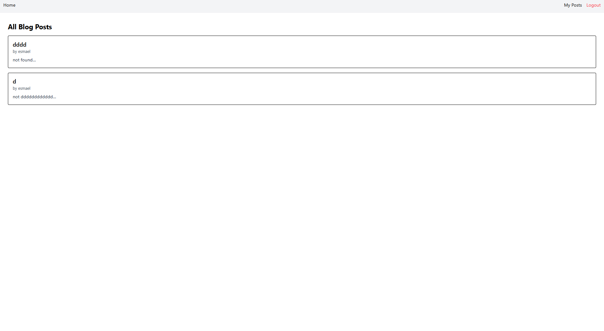
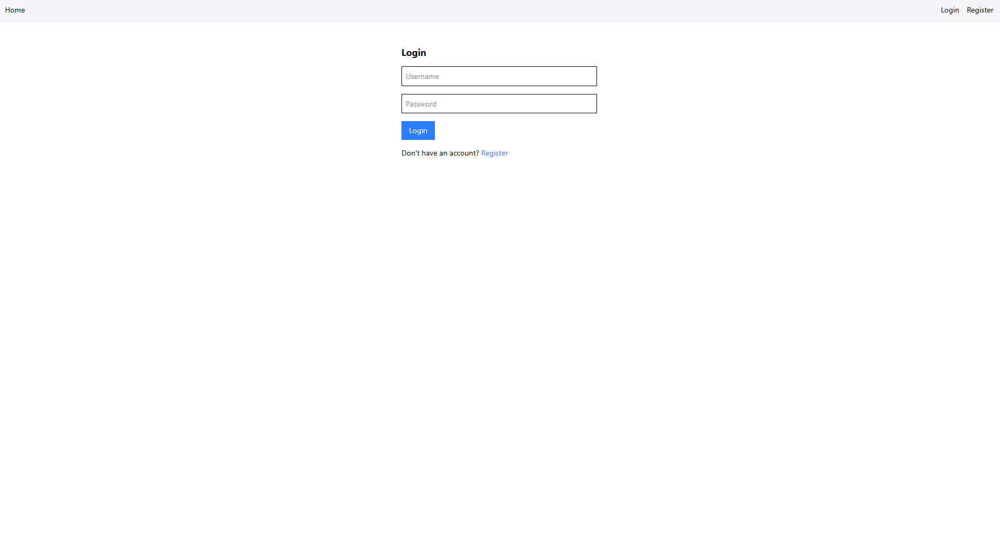

# 📝 Blog App

A simple and modern blog system built using **React**, **Vite**, **Tailwind CSS**, and **React Router**.

> 🔗 **Live Demo**: [esmael-blog-app.vercel.app](https://esmael-blog-app.vercel.app)

---

## 🚀 Features

- 🔐 Authentication (Login/Register) using React Context
- 🧠 Persistent blog storage via `localStorage`
- 📝 Create, Edit, and Delete your own blog posts
- 🌐 View all public blog posts
- 🎨 Responsive and animated UI using Tailwind CSS and Framer Motion
- 🔄 Real-time updates without a backend
- 🔍 Routing with React Router

---

## 📦 Technologies Used

- [Vite](https://vitejs.dev/) – Lightning fast dev environment
- [React](https://react.dev/) – UI Library
- [Tailwind CSS](https://tailwindcss.com/) – Utility-first CSS
- [React Router](https://reactrouter.com/) – Client-side routing
- [Framer Motion](https://www.framer.com/motion/) – Animations

---

## 🛠 Installation

```bash
git clone https://github.com/esmaelhussen/blog-app.git
cd blog-app
npm install
npm run dev


## 🖼️ Screenshots

### 📍 Home page



### 📍 Login Page


